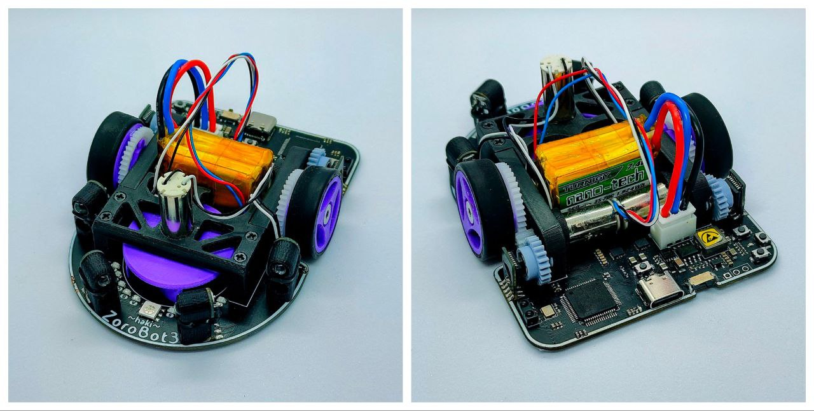
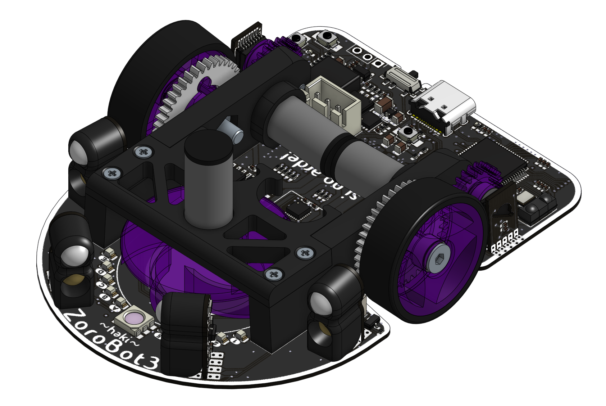

# ZoroBot3
Tercera versión de nuestro primer robot. Un robot micromouse de alto rendimiento con STM32F4, encoders magneticos de alta resolución, succión y muchos leds molones.

## Hardware
- **Microcontrolador**: STM32F405RGT6 @168MHz
- **Driver de motores**: MP6551 @20kHz
- **Giroscopio**: LSM6DSRTR 4000dps
- **Encoders**: AS5145B-HSST
- **Mosfets**: AO3400 (A09T) Tanto para conmutar los emisores de los sensores como para la succión
- **Regulador**: CN3903 + LDO ME611C33M5G
- **Receptor IR 38kHz**: TSSP77038TR
- **Bateria**: LiPo 2S 260mAh 35-70C Turnigy nano-tech
- **Sensores**:
  - 4 Emisores IR SFH-4550
  - 4 Receptores IR ST-1KL3A
  
- **Tracción**:
  - 2x Motores Coreless 8520 7.4v genéricos (AliExpress)
  - Goma de ruedas Kyosho K.MZW39-30
  - Chasis de PCB con soportes de motores y ventilador en PLA
  - Piñones de motores 8T 0.5M
  - Engranajes de las ruedas 40T 0.5M
  - Engranajes de los encoders 22T 0.5M impresos en resina
  - 4x Rodamientos MR63ZZ (Ruedas)
  - 2x Rodamientos MR52ZZ (Encoders)
  - 2x Imán radial 6x2.5mm

## Software
- Programado en VSCode y PlatformIO con LibOpenCM3.
- Todos los valores analógicos se leen mediante **DMA** y son procesados cada 1ms.
- Los sensores se leen mediante una máquina de estados a 16kHz, enciendiendo y apagando los emisores para **filtrar la luz ambiente**.
- El valor de los encoders se lee en **cuadratura por hardware** mediante dos timers.
- El MPU se lee mediante SPI.
- El bucle principal de control, del que constan los PID de velocidad lineal, velocidad angular, control frontal y control lateral se ejecuta cada 1ms.
- Se realiza un reseteo de posición por périda de pared lateral para mejorar la navegación.
- Las curvas se realizan mediante perfiles de giro con **aceleración senoidal** para mayor suavidad.
- Dispone de programas para seguimiento de pared derecha/izquierda, exploración y resolución mediante floodfill basado en pesos (más información en [TimeBased FloodFill Simulator](https://github.com/OPRobots/TimeBased-FloodFill-Simulator)) y hardcodeo de movimientos.

## Victoria de ZoroBot3 en la OSHWDem2024
https://github.com/user-attachments/assets/b749b48b-d331-48f7-bc95-2def68d67b7c
